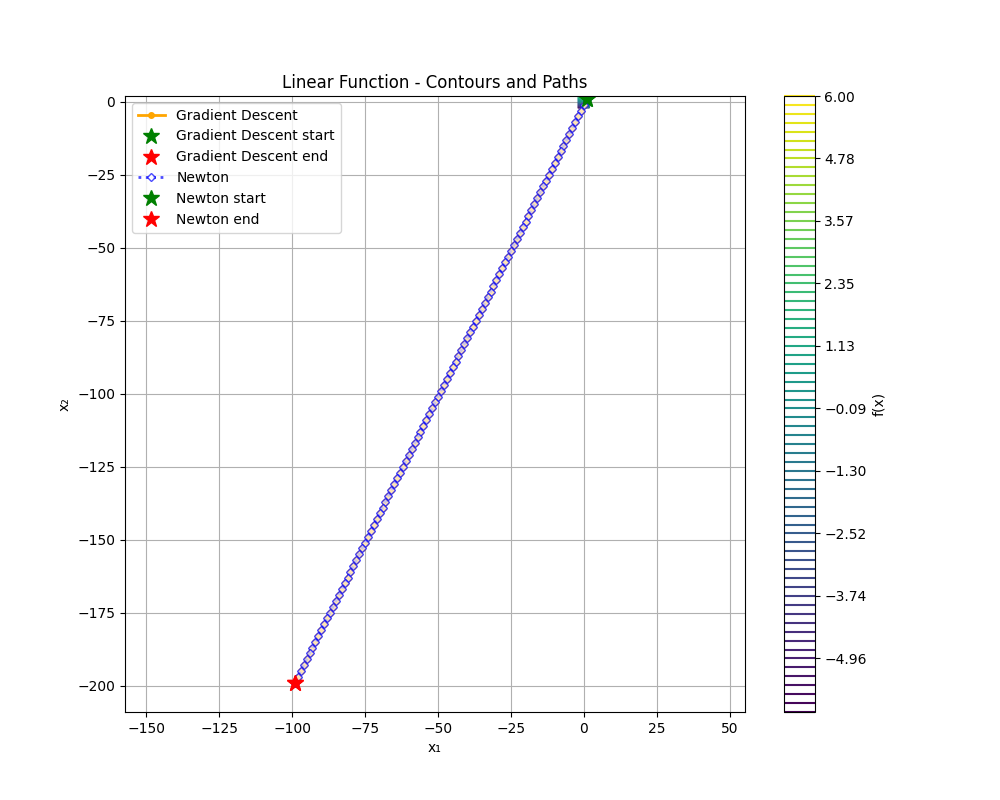

# Numerical Optimization with Python

## [Github Link](https://github.com/daryakoval/Numerical_Optimization_with_Python)

---

## Boyd's Example

### Function
**f(x₁, x₂)** = exp(x₁ + 3x₂ - 0.1) + exp(x₁ - 3x₂ - 0.1) + exp(-x₁ - 0.1)  
*(from Boyd’s book, p. 470, example 9.20)*

### Gradient Descent
- **Iterations completed:** 29  
- **Final x:** `[-3.46572886e-01 -9.76799665e-07]`  
- **Final f(x):** `2.559266696664345`  
- **Gradient norm:** `7.802781331277717e-06`  
- **Converged:** `True`  
- **Termination reason:** Objective value convergence (`|f_new - f_x| = 3.20e-13 < 1.00e-12`)

### Newton
- **Iterations completed:** 8  
- **Final x:** `[-3.46573590e-01  6.80690347e-12]`  
- **Final f(x):** `2.5592666966582156`  
- **Gradient norm:** `8.258686061044686e-11`  
- **Converged:** `True`  
- **Termination reason:** Newton decrement condition satisfied (`newton_decrement/2 = 3.99e-22 < 1.00e-12`)

#### Visualizations
  

---

## Linear Function

### Function
**f(x)** = **aᵀx** for some nonzero vector **a**  
(Contour lines are straight lines)

### Gradient Descent
- **Iterations completed:** 100  
- **Final x:** `[-99. -199.]`  
- **Final f(x):** `-497.0`  
- **Gradient norm:** `2.23606797749979`  
- **Converged:** `False`  
- **Termination reason:** Maximum iterations (100) reached without convergence

### Newton
- **Iterations completed:** 100  
- **Final x:** `[-99. -199.]`  
- **Final f(x):** `-497.0`  
- **Gradient norm:** `2.23606797749979`  
- **Converged:** `False`  
- **Termination reason:** Maximum iterations (100) reached without convergence

#### Visualizations
  

---

## Quadratic 1 (Circular)

### Function
**f(x)** = **xᵀQx**, where  
Q = \[ [1, 0],  
    [0, 1] \]  
(Contour lines are circles)

### Gradient Descent
- **Iterations completed:** 2  
- **Final x:** `[0. 0.]`  
- **Final f(x):** `0.0`  
- **Gradient norm:** `0.0`  
- **Converged:** `True`  
- **Termination reason:** Objective value convergence (`|f_new - f_x| = 0.00e+00 < 1.00e-12`)

### Newton
- **Iterations completed:** 1  
- **Final x:** `[0. 0.]`  
- **Final f(x):** `0.0`  
- **Gradient norm:** `0.0`  
- **Converged:** `True`  
- **Termination reason:** Newton decrement condition satisfied (`newton_decrement/2 = -0.00e+00 < 1.00e-12`)

#### Visualizations
_contours.png)  
_objectives.png)

---

## Quadratic 2 (Axis-Aligned Elliptical)

### Function
**f(x)** = **xᵀQx**, where  
Q = \[ [1, 0],  
    [0, 100] \]  
(Contour lines are axis-aligned ellipses)

### Gradient Descent
- **Iterations completed:** 100  
- **Final x:** `[0.11271997 0.0008856 ]`  
- **Final f(x):** `0.012784220095399295`  
- **Gradient norm:** `0.28669575126210883`  
- **Converged:** `False`  
- **Termination reason:** Maximum iterations (100) reached without convergence

### Newton
- **Iterations completed:** 1  
- **Final x:** `[0. 0.]`  
- **Final f(x):** `0.0`  
- **Gradient norm:** `0.0`  
- **Converged:** `True`  
- **Termination reason:** Newton decrement condition satisfied (`newton_decrement/2 = -0.00e+00 < 1.00e-12`)

#### Visualizations
_contours.png)  
_objectives.png)

---

## Quadratic 3 (Rotated Elliptical)

### Function
**f(x)** = **xᵀQx**, where  
Q = Rᵀ × D × R  
with:  
- R = \[ [√3/2, -0.5],  
    [0.5, √3/2] \]  
- D = \[ [100, 0],  
    [0, 1] \]  
(Contour lines are rotated ellipses)

### Gradient Descent
- **Iterations completed:** 100  
- **Final x:** `[0.07682763 0.13062022]`  
- **Final f(x):** `0.02311258419270041`  
- **Gradient norm:** `0.38965808958649545`  
- **Converged:** `False`  
- **Termination reason:** Maximum iterations (100) reached without convergence

### Newton
- **Iterations completed:** 1  
- **Final x:** `[0. 0.]`  
- **Final f(x):** `0.0`  
- **Gradient norm:** `0.0`  
- **Converged:** `True`  
- **Termination reason:** Newton decrement condition satisfied (`newton_decrement/2 = -0.00e+00 < 1.00e-12`)

#### Visualizations
_contours.png)  
_objectives.png)

---

## Rosenbrock Function

### Function
**f(x₁, x₂)** = 100(x₂ − x₁²)² + (1 − x₁)²  
(Contour lines are banana-shaped ellipses — **not convex**)

### Gradient Descent
- **Iterations completed:** 7751  
- **Final x:** `[0.99989437 0.99978771]`  
- **Final f(x):** `1.1267173492054864e-08`  
- **Gradient norm:** `0.0001349176937039971`  
- **Converged:** `True`  
- **Termination reason:** Objective value convergence (`|f_new - f_x| = 7.48e-13 < 1.00e-12`)

### Newton
- **Iterations completed:** 20  
- **Final x:** `[0.99999999 0.99999998]`  
- **Final f(x):** `2.7300933598972337e-16`  
- **Gradient norm:** `6.237591903077127e-07`  
- **Converged:** `True`  
- **Termination reason:** Newton decrement condition satisfied (`newton_decrement/2 = 2.73e-16 < 1.00e-12`)

#### Visualizations
  

